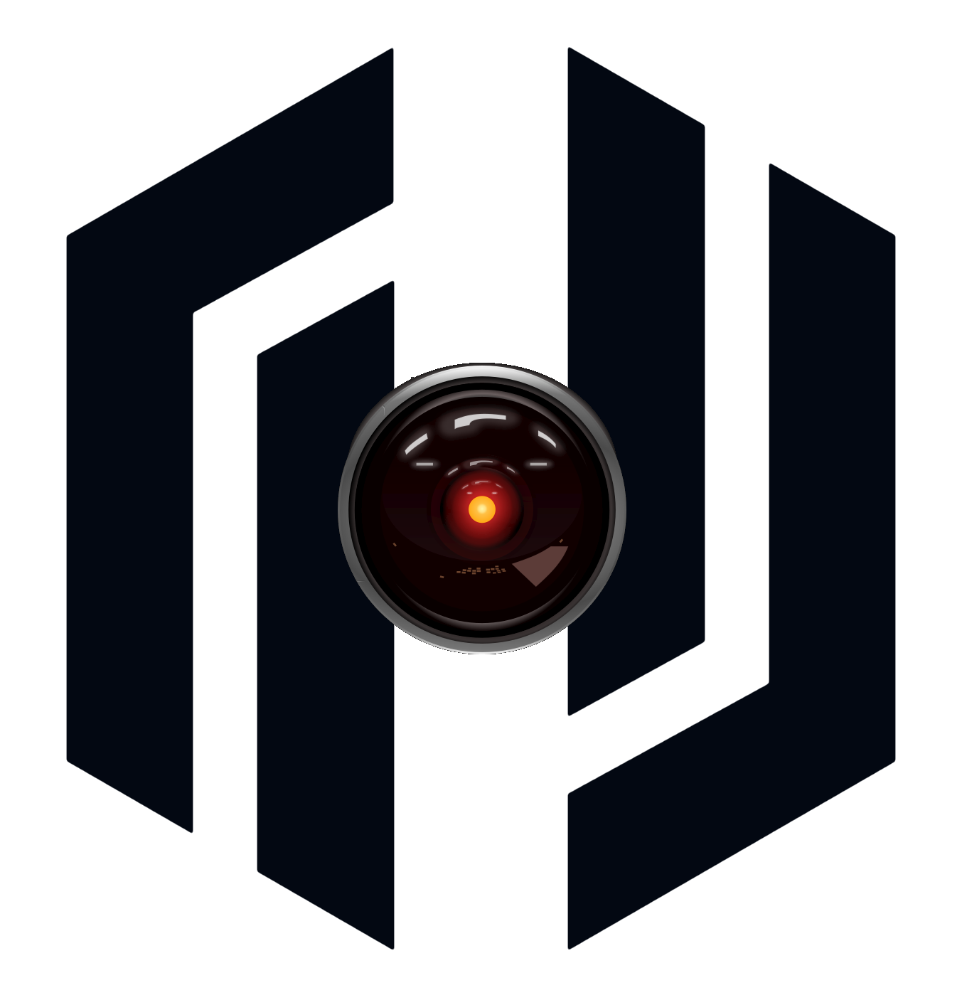

<div align="center">
  
</div>

# HAL - HashiCorp Academy Labs

HAL is a local DevOps lab orchestrator for HashiCorp products.

It helps you stand up realistic local environments for Vault, Boundary, Consul, Nomad, Terraform Enterprise (FDO), and observability without hand-writing large compose/manifests for every demo.

## What HAL Does Well

- Fast local product labs with sensible defaults.
- Read-only first status UX (`hal <product>` defaults to status for most product commands).
- Product + feature lifecycle patterns:
  - Core products: `create`, `update`, `status`, `delete`
  - Feature flows: `enable`, `update`, `disable`
- Built-in integration scenarios (OIDC, JWT, K8s auth/VSO, Boundary targets, TFE workspace automation).

## Installation

### macOS and Linux (Homebrew)

```bash
brew tap hashimiche/tap
brew install hal
```

### Manual

Download binaries from the Releases page:

- https://github.com/hashimiche/hal/releases

## Prerequisites

Install the tools required by the labs you want to run:

- Docker or Podman (required for most flows)
- KinD + kubectl + helm (required for `hal vault k8s`)
- Multipass (required for `hal nomad` and `hal boundary ssh`)

## Quick Start

```bash
# Global snapshot
hal status

# MCP bridge bootstrap (stdio)
hal mcp create
hal mcp status

# Capacity advisor views
hal capacity
hal capacity --active
hal capacity --pending

# Bring up Vault core
hal vault create
hal vault status

# Bring up Terraform Enterprise local stack
hal terraform create
hal terraform workspace enable
hal terraform status
```

## Reproducible Version Pins

Use explicit image/version flags when you want deterministic labs across machines or over time.

```bash
# Vault core with explicit version + helper image
hal vault create --version 2.0 --helper-image alpine:3.22

# Vault LDAP demo with pinned OpenLDAP + phpLDAPadmin tags
hal vault ldap enable --openldap-version 1.5.0 --phpldapadmin-version 0.9.0

# Vault K8s demo with pinned KinD node image, VSO chart, backend/proxy images
hal vault k8s enable \
  --kind-node-image kindest/node:v1.31.1 \
  --vso-chart-version 0.8.1 \
  --web-backend-image httpd:2.4-alpine \
  --web-proxy-image nginx:alpine

# Terraform Enterprise stack with pinned supporting images
hal terraform create \
  --version 1.2.0 \
  --pg-version 16 \
  --redis-version 7 \
  --minio-version latest \
  --minio-api-port 19000 \
  --minio-console-port 19001 \
  --proxy-nginx-version alpine

# Nomad VM with pinned Ubuntu image channel
hal nomad create --ubuntu-image 22.04 --version 1.11.3

# Boundary SSH target VM with pinned image and VM sizing
hal boundary ssh enable --ubuntu-image 22.04 --cpus 1 --mem 512M
```

💡 Tip: check available flags with `hal <product> <command> --help`.

## Command and Subcommand Recap

For the full surface and latest flags, use `hal --help` and `hal <product> --help`.

### Global commands

- `hal status`
- `hal capacity` (`--active`, `--pending`)
- `hal catalog`
- `hal version`
- `hal delete` (global teardown)

### Product command table

| Namespace | Product lifecycle commands | Feature subcommands | Feature lifecycle actions |
|---|---|---|---|
| `hal vault` | `create`, `update`, `status`, `delete` | `audit`, `database`, `jwt`, `k8s`, `ldap`, `oidc` | `enable`, `update`, `disable` |
| `hal boundary` | `create`, `update`, `status`, `delete` | `mariadb`, `ssh` | `enable`, `update`, `disable` |
| `hal consul` | `create`, `update`, `status`, `delete` | none | n/a |
| `hal nomad` | `create`, `update`, `status`, `delete` | `job` | n/a |
| `hal obs` | `create`, `update`, `status`, `delete` | none | n/a |
| `hal terraform` (`hal tf`) | `create`, `update`, `status`, `delete` | `agent`, `cli`, `twin`, `workspace` | `enable`, `update`, `disable` |
| `hal mcp` | `create`, `update`, `status`, `delete` | `policy` | currently read-only (`policy`) |

### Common usage examples

```bash
# Product lifecycle
hal vault create
hal vault update
hal vault status
hal vault delete

# Feature lifecycle
hal vault k8s enable
hal vault k8s update
hal vault k8s disable

# Terraform workspace lifecycle (now includes disable)
hal terraform workspace enable
hal terraform workspace update
hal terraform workspace disable
```

### MCP quick notes

- `hal mcp create` generates MCP config scaffold at `~/.hal/mcp/hal-mcp.json`.
- `hal mcp update` runs/reconciles the MCP server over stdio.
- `hal mcp status` checks MCP readiness.
- `hal mcp delete` stops a background MCP process if a PID file exists.

MCP tools exposed by HAL (read-only MVP+):

- `hal_status` (global status with executed command metadata)
- `hal_capacity` (current/active/pending views, strict args)
- `hal_product_status` (per-product status, strict args)
- `hal_help` (returns real HAL help output to ground command syntax)
- `hal_snapshot` (batched grounded snapshot across status/capacity/product status)
- `hal_status_baseline` (alias for runtime baseline status routing)
- `hal_plan_deploy` (alias for intent-driven deploy/setup planning)
- `hal_plan_verify` (deterministic post-action verification command plan)

## Vault K8s Demo Modes

`hal vault k8s` deploys a KinD + Vault Secrets Operator lab with a direct endpoint:

- http://web.localhost:8088

No `kubectl port-forward` is required in the standard flow.

### Native mode (default)

- Uses `VaultStaticSecret`.
- Syncs secret data to Kubernetes Secret.
- Injects `HAL_SECRET` as env var into backend pods.
- Backend renders local `index.html` at startup.

### CSI mode (`--csi`, Enterprise)

- Uses `CSISecrets` + `csi.vso.hashicorp.com`.
- Projects secret data as an ephemeral CSI-mounted file.
- Backend renders local `index.html` from projected data.
- If Vault Enterprise is not detected, HAL falls back to native mode.

## Useful Endpoints

- Vault: http://vault.localhost:8200
- Consul: http://consul.localhost:8500
- Boundary: http://boundary.localhost:9200
- Terraform Enterprise: https://tfe.localhost:8443
- MinIO API (TFE object storage mock): http://127.0.0.1:19000
- MinIO Console: http://127.0.0.1:19001
- Grafana: http://grafana.localhost:3000
- Prometheus: http://prometheus.localhost:9090
- Loki: http://loki.localhost:3100/ready
- Vault K8s demo: http://web.localhost:8088

## Development

From repo root:

```bash
go build -o hal main.go
go build ./...
go test ./...
```

## Contributing

Contributions are welcome.

If you are changing command behavior or UX patterns, read `LLM_CONTEXT.md`, `.github/copilot-instructions.md`, and `docs/cli-lifecycle-model.md` first so updates stay aligned with current architecture and operator guidance.

For CLI lifecycle and verb consistency, treat `docs/cli-lifecycle-model.md` as the detailed source of truth and keep it in sync with `.github/copilot-instructions.md`.