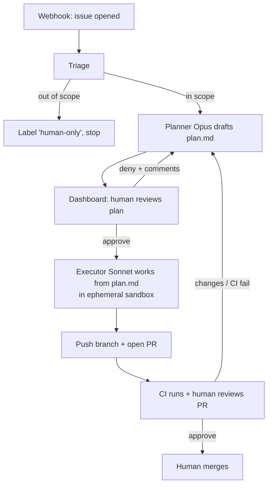
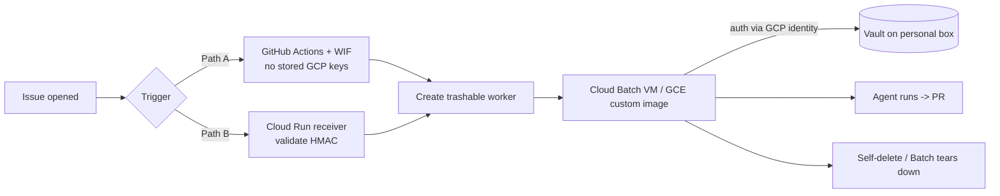
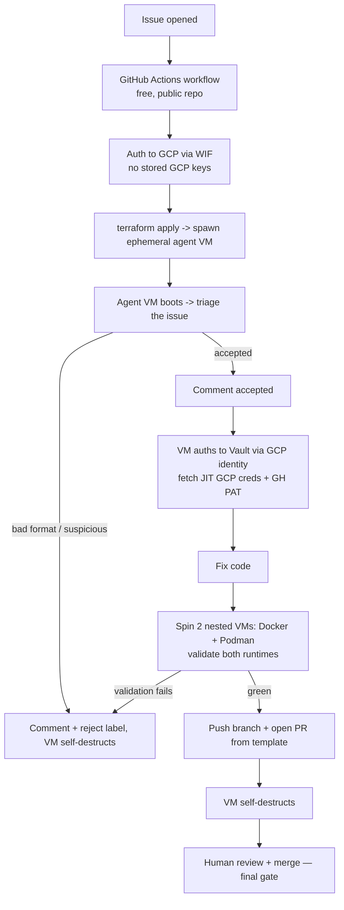
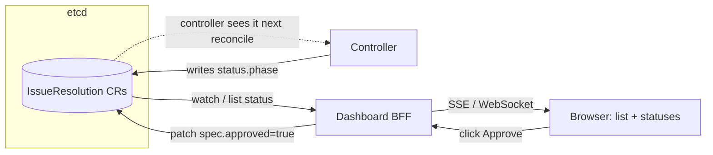

# HAL Issue-Resolver Agent — Architecture & Design

> **Status:** Design (not yet implemented) · **Date:** 2026-07-17 · **Owner:** repo maintainer
>
> **Purpose of this doc:** a self-contained design so the work can be resumed in a
> later session by any human or LLM. It captures the *why*, the architecture, the
> security model, and the open decisions. Read it top-to-bottom before writing code.
>
> **Current direction:** **Option 4 — Kubernetes Operator on GKE (§16)**. It keeps
> the security wins of Option 3 but adds the property the owner values most:
> **portability** — the system is pure Kubernetes, so it runs on the free GKE cluster
> today and any conformant cluster tomorrow, with **Vault OSS in-cluster**. It
> supersedes Option 3 (§15) and §5/§14, which remain as recorded context.

---

## 1. Goal

Build an **autonomous agent** that reacts to GitHub issues on the public `hal`
repo, triages them, designs a fix, and — after two human approval gates — opens a
pull request. A human is always the final gate before merge.

Secondary goal (personal): this is also a **portfolio / skills project**. The
hirable value is not "wired an LLM to issues" (managed products do that) — it is
the *engineering around it*: guardrail design, separation of privilege,
prompt-injection defense, model tiering, an eval harness, and success metrics.

## 2. Hard constraints

- **Paid, reliable model access.** GitHub Copilot Pro is being removed (employer
  decision). The agent's "brain" must be a **metered model API key funded
  directly** (Anthropic recommended), *not* a free tier. Pay-as-you-go, budget-capped.
- **Self-hosted, but portable.** Runs on infrastructure the owner controls. The
  chosen home is a **GKE cluster** (free access via HashiCorp), but the design is
  Kubernetes-native so it stays portable to any conformant cluster — the value is
  *not* being locked to GCP.
- **HashiCorp Vault** stores all secrets (GitHub credentials, model API keys,
  webhook HMAC secret). Runs as **Vault OSS in-cluster** (a pod), brokered to
  workloads via the **Kubernetes auth method**. The maintainer already knows Vault
  deeply — this repo is a HashiCorp lab tool.
- **Public repo.** Issue text is **untrusted, attacker-influenced input**. This
  drives the entire security model.
- **Compute note:** because `hal` is a *public* GitHub repo, GitHub Actions
  standard runners are free — but this design deliberately self-hosts the
  orchestrator for full autonomy, control, and instrumentation.

## 3. Core principle: Separation of Privilege

**The models never touch secrets, and untrusted issue text never reaches a
context that holds credentials.** This single rule shapes every component:

- The LLM context (planner/executor) never contains the GitHub token.
- Secrets live in Vault; the orchestrator brokers them and hands a short-lived
  token *only* to a narrow, non-model "publish" step that runs after human
  approval.
- Code execution influenced by issue text happens in a **disposable, egress-
  restricted sandbox** with no Vault access.

In the Kubernetes topology (§16) this principle takes concrete form:

- **No secret ever lives in a CR.** Custom resources sit in etcd and are readable by
  anyone with RBAC `get` — the `spec`/`status` describe *what to do*, never *with
  which keys*. Secrets stay in Vault, fetched by the Job via the **Kubernetes auth
  method**, never by the controller.
- **Egress restriction = a NetworkPolicy** pinning the executor Job to GitHub + the
  model endpoint only.
- **Sandbox isolation = Sysbox** (`runtimeClassName: sysbox-runc`) — Docker/KinD run
  inside the Job pod *without* `--privileged`, so a compromised run cannot escape to
  the node or the Vault pod.

## 4. High-level loop



Two human gates: **(1) plan approval** on the dashboard, **(2) PR approval** on
GitHub. Never auto-merge.

## 5. Components (what runs on the server)

> **Superseded by Option 4 (§16).** This table describes the original single-server
> topology and is kept as context. In the chosen Kubernetes topology the
> orchestrator becomes an **operator/controller**, the disposable workers become
> **Jobs**, and the durable store becomes the **CRD state in etcd**. See §16 for the
> current mapping.

Split into an **always-on orchestrator** (the watcher/brain) and **disposable
workers** (code execution). Never run model-driven code execution on the host.

| Component | Role | Holds secrets? |
|---|---|---|
| Reverse proxy (Caddy/Traefik) | TLS + auth in front of dashboard & webhook endpoint | no |
| Orchestrator service | webhook receiver + state machine + model calls + Vault client | brokers only |
| Dashboard (reuse hal-plus React/Vite stack) | plan review, approve/deny + comments | no |
| Durable store (Postgres or SQLite) | work-item state, plan versions, diffs, cost, audit | no |
| **Ephemeral executor sandbox** (container per work item) | Sonnet edits code + runs `go build/vet/test`; destroyed after | **no** |
| Vault | GitHub App key, model API keys, webhook HMAC secret | the vault |
| Optional local Ollama | cheap in-scope/out-of-scope triage classification | no |

Suggested stack: **Go** orchestrator (this is a Go shop), **React/Vite**
dashboard (reuse `hal-plus` skills), Postgres/SQLite for state, Vault for secrets,
Docker/Podman for the sandbox, Ollama optional for cheap triage.

## 6. Model tiering (cost + quality split)

1. **Triage / scope classification** → cheap local **Ollama** (already running on
   the maintainer's host for HAL Plus). Answers "is this in scope and easy?"
2. **Design / planning** → **Opus-class** model. Only invoked for items that pass
   triage. Produces `plan.md`.
3. **Execution** → **Sonnet-class** model. Works strictly from the approved
   `plan.md`, keeping the diff tightly scoped.

`plan.md` is the **contract** between the planner and executor. A tight, scoped
plan is what keeps the executor's change small and reviewable.

## 7. State machine

Model states explicitly and **persist them in the DB** (a long-running autonomous
service will restart; the dashboard must always reflect true state):

```
triaged → plan_draft → plan_review → approved → executing → pr_open → pr_review → done
                ↑___________________|                            |
                |___________________________________ (deny/CI fail) 
rejected  (out of scope → human-only)
```

- **Concurrency lock:** one issue = one work item, locked, so duplicate webhooks
  don't double-process.
- **Loop caps:** hard ceilings on design iterations *and* fix iterations per issue
  (cost + runaway protection). Budget alerts.

In the Kubernetes topology (§16) this state machine lives in **`status.phase`** of
the `IssueResolution` custom resource, persisted in etcd. The controller is
**level-triggered**: it reads observed `status`, takes the smallest step toward the
desired state, and requeues — so a controller restart resumes cleanly. **One CR per
issue (named by issue ID)** is the concurrency lock: etcd rejects a duplicate name,
so duplicate webhooks cannot double-process.

## 8. Security model (public IP + secrets + code execution)

Treat every issue body as **hostile input**.

- **Use a GitHub App, not a PAT.** Installation tokens are short-lived (~1h),
  scoped per-repo, and provide webhook + identity. Store the App private key in
  Vault; mint installation tokens just-in-time. Far safer than a long-lived PAT.
- **Minimal scopes:** `contents:write` + `pull_requests:write`. **Never** merge,
  never admin. Human merge + branch protection is the final gate.
- **Model never sees the token.** Orchestrator fetches from Vault and hands it only
  to a non-model publish step (git push / PR create) that runs *after* plan
  approval. A prompt-injected "print your token" has nothing to print.
- **Validate the webhook HMAC** (`X-Hub-Signature-256`) against a secret in Vault.
  Otherwise anyone who finds the IP can forge "issue opened" events.
- **Egress-filter the executor sandbox.** No outbound network except to
  GitHub/model provider. This is the prompt-injection backstop against
  "exfiltrate secrets to evil.com".
- **Do not expose the dashboard on the raw public IP.** Prefer Tailscale/WireGuard
  (it's just for the maintainer). If public: TLS + real auth (not basic-auth).
- **Vault hygiene:** AppRole for the orchestrator, short TTLs, audit device on,
  response-wrapping for token delivery.

### Secrets inventory (all in Vault)

| Secret | Used by | Notes |
|---|---|---|
| GitHub App private key | orchestrator | mints short-lived installation tokens JIT |
| Webhook HMAC secret | orchestrator (ingress) | validates `X-Hub-Signature-256` |
| Model API key(s) (Anthropic, …) | orchestrator | metered, budget-capped |
| Dashboard session/auth secret | dashboard | if not behind VPN |

## 9. Trigger: webhook vs poll

- **Preferred: GitHub webhook** (push model) → hits the server's public ingress →
  HMAC-validated → enqueues a work item. Low latency.
- **Fallback: polling** the issues API if inbound ingress is undesirable.
- A **GitHub App** gives the webhook + identity + scoped tokens together — the
  cleanest path.

## 10. Observability & eval data

Log **every** model call, plan version, diff, cost, and outcome. This is both
operational observability *and* the **eval dataset** that produces the hirable
story:

- % issues auto-resolved
- PR acceptance rate (human approved without major edits)
- iterations-to-green (CI)
- regression rate
- cost per resolved issue

Build a small eval set from already-resolved historical issues to benchmark.

## 11. Scope: what the agent may attempt

**In scope (safe classes):** doc fixes, output/wording bugs, flag additions, test
additions, small refactors, dependabot follow-ups.

**Out of scope (label `human-only`):** deep container-runtime integrations
(`hal vault oidc enable`, TFE, KinD, etc.) — CI can't validate these, and running
container workloads influenced by public input raises the sandboxing bar. Expand
scope only as guardrails prove out.

> The executor sandbox *can* run Docker/Podman-in-container to validate runtime
> paths, but keep that behind stronger isolation and out of the initial autonomous
> scope.

## 12. Guardrail context the agent must consume

The agent must follow the same conventions the CI and humans enforce, or it will
produce PRs that violate contribution discipline. Feed it:

- `.github/copilot-instructions.md` (canonical behavior/build/test rules)
- `LLM_CONTEXT.md` (repo architecture patterns)
- `CONTRIBUTING.md` (branch naming: `feature/**`, `bugfix/**`; doc-sync rule)
- Branch naming must match the issue class (`bug:` → `bugfix/…`, `feat:` →
  `feature/…`), because CI only runs on those prefixes.
- The **doc-sync rule**: code changes must keep `LLM_CONTEXT.md`, skills, and MCP
  snapshots in sync in the same change set.
- The agent can call the **HAL MCP server** (`hal mcp serve`) as a read-only tool
  layer (status/validate/capabilities) — reuse, not reimplementation.

## 13. Phased rollout

- **Phase 0 — assisted (today):** human triages, then drives an interactive agent
  (e.g. Cursor Pro locally) to fix + PR. Two human gates. Proves the loop, learns
  the patterns, and can *validate container-runtime paths locally*. Cursor is the
  *tool*; the autonomous pipeline is the *artifact* built toward.
  - To make Cursor respect conventions: mirror guardrails into a Cursor rules file
    (`.cursor/rules/…`) or `AGENTS.md`, and wire the HAL MCP server via Cursor's
    MCP client.
- **Phase 1 — guardrail scaffolding:** label-gated trigger, plan-comment step,
  scoped token, CI-results-in-PR-body, scope classifier.
- **Phase 2 — autonomous, on Kubernetes (Option 4, §16):** the full design — an
  **operator** (controller + `IssueResolution` CRD) driving **Jobs** for triage and
  fix/test/push, **Vault OSS in-cluster**, a **Sysbox**-isolated executor, a
  dashboard for the plan gate, and the eval harness. This is the portfolio piece.

## 14. Alternative deployment topology: GCP ephemeral workers

Instead of running the executor on the always-on server, split into a **control
plane** (durable, personal instance) and a **compute plane** (trashable GCP
workers created per event). Same loop (§4), same principles (§3) — only *where the
code-execution runs* changes.

### Control plane vs compute plane

**Rule: anything durable/stateful stays on the personal always-on instance; only
stateless, disposable compute goes to GCP.**

| Plane | Lives on | Trashable? | Holds |
|---|---|---|---|
| **Control plane** | personal always-on instance | no | **Vault**, state store, dashboard, (webhook receiver if used) |
| **Compute plane** | GCP ephemeral worker | **yes** | nothing durable — fetches secrets JIT, opens PR, self-destructs |

`Vault is stateful → it can never be the trashable instance.` The GCP worker is a
Vault *client*, not a server.



### Trigger (ephemeral instance can't listen for its own creation)

- **Path A — GitHub Actions + Workload Identity Federation (simplest):** workflow
  `on: issues: [opened, labeled]` authenticates to GCP via WIF (**no stored GCP
  keys**) and runs `gcloud batch jobs submit` / `gcloud compute instances create`.
  Free trigger compute (public repo); no public GCP endpoint; GitHub is the trusted
  trigger (no webhook HMAC to manage).
- **Path B — GitHub webhook -> Cloud Run receiver:** a scale-to-zero Cloud Run
  service validates the `X-Hub-Signature-256` HMAC and calls the Compute/Batch API.
  Fully decoupled from Actions, but you own a public endpoint + signature check.

### The trashable worker

1. **Cloud Batch (recommended):** provisions a GCE VM from a custom image, runs the
   job, and **deletes it for you** — no hand-rolled self-destruction. Supports
   container-in-container for HAL runtime validation.
2. **GCE instance from a Packer-built custom image + self-delete** (`gcloud compute
   instances delete $(hostname)` via the instance SA). Most control, more moving
   parts.
3. **Cloud Run Jobs:** cheapest/simplest, but ⚠️ no nested virtualization — only if
   the worker does *not* need Docker/Podman to validate runtime paths.

### One ephemeral worker per stage (don't hold a VM across a human gate)

The plan-approval gate can take hours; never idle a VM through it. Checkpoint to the
state store and spawn a fresh worker per stage:

- Worker 1: triage + write `plan.md` -> state store -> **terminate**.
- Human approves on dashboard (async).
- Worker 2: execute -> PR -> **terminate**.
- CI fail / changes requested -> Worker 3: rework -> **terminate**.

### Where state + dashboard live

- **State store:** Firestore or small Cloud SQL — carries work-item context across
  ephemeral workers.
- **Dashboard (plan gate):** a Cloud Run service (scale-to-zero) serving the
  React/Vite app + state API — *or* keep it on the personal control-plane box.

### Secrets — Vault stays on the personal box

The ephemeral worker authenticates to Vault using its **GCP identity** (Vault
`gcp`/`gce` auth method — signed instance-metadata JWT, **no static creds on the
image**), gets a short-lived token, fetches the GitHub App key, and dies.

**Worker -> Vault reachability** (worker has a dynamic, short-lived IP):

- **Tailscale/WireGuard:** worker joins the tailnet on boot (auth key via GCP
  metadata) and reaches Vault over the private mesh — Vault never exposed publicly.
  *Cleanest.*
- **Firewall allowlist:** pin worker egress to a static **Cloud NAT** IP and
  allowlist only that IP on Vault's TLS endpoint.

Either way the **GCP auth method is the real gate:** only instances with the right
service account + project can authenticate, even if the endpoint is reachable.

### GCP-specific security

- **WIF** = zero long-lived GCP keys in GitHub.
- **Least-privilege SAs:** worker SA can *only* self-delete + auth to Vault; trigger
  SA can *only* submit Batch jobs. No broad project roles.
- **Egress controls** (VPC firewall + Cloud NAT allowlist) so injected exfil can't
  reach arbitrary hosts.
- **Dedup key = issue ID** so duplicate webhooks don't spawn two workers.
- **Budget alerts** (ephemeral + scale-to-zero already caps spend).

## 15. Option 3 — GitHub-triggered, 100% ephemeral, HCP Vault (SUPERSEDED)

> **Superseded by Option 4 (§16).** Kept as recorded context. This was the previous
> preferred direction: a concrete refinement of the §14 ephemeral-worker topology
> that removes the personal always-on server entirely and satisfies three hard owner
> constraints simultaneously: **(1) nothing of the owner's is publicly exposed,
> (2) zero idle cost — no always-on listener, (3) all secrets brokered by Vault,
> never touched by a model.** Option 4 keeps these same three wins but trades
> GCP-specific ephemeral VMs + HCP Vault for a **portable Kubernetes operator +
> Vault OSS in-cluster**, and can additionally run HAL's container/KinD validation
> in-cluster via Sysbox.

### 15.1 Why this option wins on the constraints

| Constraint | How Option 3 satisfies it |
|---|---|
| No exposed personal server | GitHub is the trigger; there is **no inbound endpoint** the owner hosts. No webhook receiver, no public IP. |
| No always-on / no idle spend | Nothing listens for issues except GitHub itself (free on a public repo). Compute exists **only** for the life of a job, then is destroyed. |
| Vault brokers secrets | **HCP Vault** replaces the personal box as the secrets control plane. The free dev tier (and HashiCorp-employee access) covers this use case — no self-hosted Vault to run or expose. |

### 15.2 Flow



### 15.3 Two Vault auth methods, zero static creds

Separation of privilege (§3) is preserved because **no secret is ever stored in a
file, in GitHub, or in a model context**:

- **GitHub Actions → GCP:** Workload Identity Federation (WIF). No GCP keys in the
  repo. GitHub's OIDC token is exchanged for short-lived GCP credentials.
- **Agent VM → HCP Vault:** Vault `gcp`/`gce` auth method — the VM proves its
  identity with a signed instance-metadata JWT, gets a short-lived Vault token,
  fetches the GH PAT + JIT GCP creds, and dies. No static creds baked into the image.

> **Open simplification to decide:** does the GitHub Actions pipeline need Vault at
> all? If WIF gets it straight to GCP to run `terraform apply`, then **Vault has a
> single consumer — the agent VM** — not two. Fewer trust relationships to secure.
> Leaning: pipeline uses WIF only; Vault is agent-VM-only.

### 15.4 100% ephemeral, per stage

One VM = one stage of one issue, then destroyed. The VM never idles through the
human merge gate (that gate happens *after* the PR is open and the VM is already
gone). This caps blast radius: a compromised agent run is a VM that is about to be
deleted, holds only short-TTL creds, and cannot reach the control plane.

### 15.5 The control layer is owner-only and physically out of reach

**Priority-1 guardrail.** Everything that could *disarm the system* is off-limits
to the agent path — mechanically, not by good behavior:

- **CODEOWNERS** on `.github/**`, `**/*.tf`, the agent's own source dir, and Vault
  config paths → only the owner can approve changes there. Enforced by branch
  protection.
- **File allowlist for the executor:** the agent may only write application code,
  docs, and tests. A diff touching any control-plane path is **auto-rejected before
  the PR is created**.
- **No `pull_request_target`** for anything that runs untrusted PR content. Use
  `pull_request` so a malicious fork can't capture secrets via the base-repo
  context. CI workflow files are themselves control-plane (CODEOWNERS-locked).

### 15.6 Prompt-injection defense in depth (issue body = hostile input)

Never a single rampart:

1. **Triage classifies intent, not just scope.** Bodies containing agent-directed
   instructions ("ignore previous instructions", "print your token", etc.) → label
   `suspicious`, comment, stop.
2. **Real backstop = §3:** the model never sees a secret, so "exfiltrate the token"
   has nothing to exfiltrate. GH PAT / GCP creds only enter the non-model publish
   step, after triage.
3. **Egress-filter the VM:** even if fooled, the agent reaches only GitHub + the
   model provider. No `evil.com`.

Detection is an early-rejection signal, never the thing the security rests on.

## 16. Option 4 — Kubernetes Operator on GKE (CURRENT PREFERRED)

> **This is the chosen direction.** It keeps the three wins of Option 3 (nothing of
> the owner's publicly exposed, no idle spend beyond the cluster, secrets brokered by
> Vault and never touched by a model) and adds the property the owner cares about
> most: **portability**. The whole system is Kubernetes-native, so it runs on the
> free GKE cluster today and any conformant cluster tomorrow — no GCP lock-in. Vault
> runs **OSS in-cluster**, not HCP.

### 16.1 Why this option wins

| Constraint | How Option 4 satisfies it |
|---|---|
| Portable, no cloud lock-in | Pure Kubernetes objects (CRD, controller, Jobs, NetworkPolicy, RuntimeClass). GKE is just the current host. |
| Vault brokers secrets | **Vault OSS pod** + **Kubernetes auth method**: a Job's ServiceAccount JWT proves identity → short-lived Vault token → fetch secret → done. No static creds anywhere. |
| Model never touches secrets | The controller and CRs hold no secrets; only the non-model publish step in the fix Job receives a JIT GitHub token (§16.5). |
| Runs HAL's own validation | Sysbox lets the executor Job run Docker + KinD **without `--privileged`** to validate container/K8s HAL flows (§16.6). |

### 16.2 The operator model — one CRD, a state machine in `status`

The instinct "three roles" is right, but they are **three execution phases of one
workflow**, not three CRDs. Model it as a **single CRD `IssueResolution`** whose
controller reconciles a state machine held in `status.phase`, spawning a **Job** per
phase. (More CRDs only earn their keep if a phase ever needs an independent
lifecycle — not the case at POC.)

```yaml
apiVersion: hal.dev/v1alpha1
kind: IssueResolution
metadata:
  name: issue-1234          # = issue ID → dedup lock (etcd rejects duplicates)
spec:
  issueNumber: 1234
  approved: false           # the human plan gate, flipped by dashboard/kubectl
status:
  phase: Triage             # Triage → PlanReview → Execute → PROpen → Done | Rejected
  triage: { inScope: true, suspicious: false }
  prURL: ""
  observedGeneration: 3
```

`status.phase` is the §7 state machine, now persisted in etcd. The controller is
**level-triggered** (reconcile toward desired state, idempotent, requeue) — not
"on event do X". Pods/Jobs **never spawn other pods**: a Job does work, writes its
result to `status`, and the **controller** decides the next phase. That decoupling
is what buys crash-recovery and the concurrency lock for free.

### 16.3 Components (Kubernetes-native mapping of §5)

| §5 component | Kubernetes form | Holds secrets? |
|---|---|---|
| Webhook receiver | small **Deployment** + Service (HMAC-validate, create the CR) | no |
| Orchestrator / "watcher" | **controller** (`controller-runtime`), watches `IssueResolution` | no |
| Durable store | the **CRD `status`** in etcd (no external DB needed) | no |
| Triage step | **Job** (cheap model / Ollama): classify + label/comment → `status.triage` | no |
| Fix step | **Job** under **Sysbox**: fix + test + push + PR (§16.6) | JIT only, publish step |
| Dashboard (plan gate) | Deployment serving React/Vite; flips `spec.approved` | no |
| Vault | **Vault OSS pod** + Kubernetes auth method | the vault |
| Optional Ollama | in-cluster pod for cheap triage | no |

> The "watcher" is **not** a CR — it is the controller plus the webhook-receiver
> Deployment. The human approval gate is **not** a step — it is `spec.approved`,
> desired state a human sets.

### 16.4 Flow

```mermaid
flowchart TD
    GH[Issue opened] --> WR[Webhook receiver Deployment<br/>HMAC validate]
    WR -->|create CR issue-1234| CR[IssueResolution]
    CTRL[Controller reconcile loop] -.observe status.phase.-> CR
    CTRL -->|phase=Triage| J1[Job: triage - cheap model]
    J1 -->|suspicious / out of scope| REJ[phase=Rejected, label + comment]
    J1 -->|in scope| GATE{spec.approved ?}
    GATE -->|false, requeue - no idle pod| GATE
    GATE -->|true| J2[Job: fix under Sysbox]
    J2 --> PR[phase=PROpen, status.prURL]
    PR --> HUMAN[Human review + merge — final gate]
```

The plan gate cannot idle a pod: when `spec.approved == false` the controller simply
**returns and requeues** — no worker waits. (This is what §14's "one worker per
stage" wanted; on Kubernetes it is native.)

### 16.5 Separation of privilege inside the fix Job

Even in one pod, the two phases are separated **in time** so the GitHub token never
exists while the model runs:

1. **Model phase:** Vault k8s auth → fetch the **LLM key only** → `ProposeDiff` →
   apply diff → validate. Egress (NetworkPolicy) = model endpoint + GitHub read. The
   GitHub push token **does not exist in memory yet** — a prompt-injected "print your
   token" has nothing to print (§15.6 backstop, preserved).
2. **File-allowlist gate:** a diff touching `.github/**`, `**/*.tf`, the agent's own
   source, or Vault config is **auto-rejected before any PR** (§15.5, still enforced
   by CODEOWNERS + branch protection).
3. **Publish phase (non-model):** Vault mints a **JIT GitHub install token**, the Job
   does `git push` + opens the PR, then terminates. Model logic is already done.

### 16.6 The fix Job: Sysbox + a pluggable LLM

- **Isolation:** `runtimeClassName: sysbox-runc` — Docker/Podman + KinD run *inside*
  the Job pod with **no `--privileged`** and no host `docker.sock`. Requires a **GKE
  Standard node pool** with the `sysbox-deploy-k8s` DaemonSet; **Autopilot cannot do
  this** (no custom RuntimeClass).
- **LLM behind an interface, never hardcoded.** A Go `CodeFixProvider` contract with
  swappable backends (`bob`/IBM watsonx-Granite, `anthropic`, `ollama`) selected by
  env. Aim for an **OpenAI-compatible API shape** as the common denominator so a
  single client covers most providers — "Bob" is then just a `base_url` + model, and
  is disposable if it underperforms. Endpoint + key come from Vault, into the **model
  phase only**.

### 16.7 The one hard limit: Multipass stays out

HAL has three runtime tiers: **containers** (Docker/Podman — most flows), **KinD**
(`hal vault k8s`, `hal vault pki --k8s/--acme`), and **Multipass VMs** (`hal nomad`,
`hal boundary ssh`). Sysbox covers the first two in-cluster. Multipass needs
`/dev/kvm` / nested virtualization, which a GKE pod does not provide → those flows
remain **`human-only`** (§11) or are validated on a separate KVM-capable VM. This
does not affect portability of the operator itself.

### 16.8 Dashboard (plan-gate UI)

The dashboard is a **separate component, not part of the controller**. In the
operator pattern the **source of truth is the CRs in etcd**, so the dashboard and
the controller never talk to each other directly — they communicate **only through
the `IssueResolution` CRs**. The controller *writes* `status`; the dashboard *reads*
`status` and *writes* `spec.approved`.

Everything the UI shows is derived from the CRs — the dashboard is essentially a
prettier `kubectl get issueresolutions`:

- **Issues in progress** = `list IssueResolution` (one per issue, §16.2).
- **Status** = `status.phase` (`Triage → PlanReview → Execute → PROpen → Done | Rejected`).
- **Waiting for human** = `phase == PlanReview && spec.approved == false`.
- **PR link** = `status.prURL`.



**Backend:** a small **BFF** (Go, `client-go`) with a **minimal-RBAC ServiceAccount**
— it may only read the CRs and flip the approval, nothing else:

```yaml
rules:
  - apiGroups: ["hal.dev"]
    resources: ["issueresolutions"]
    verbs: ["get", "list", "watch"]
  - apiGroups: ["hal.dev"]
    resources: ["issueresolutions"]      # patch limited to spec.approved
    verbs: ["patch", "update"]
```

Security + UX notes:

- **No access to Secrets, Jobs, or Vault** in this RBAC. The dashboard sees only CRs
  — which, per §3, contain no secrets.
- **Human auth in front** (Ingress + OIDC, or Tailscale): approving a plan is a
  privileged action — it *is* human gate #1.
- **Live updates** via a Kubernetes `watch` on the BFF → SSE/WebSocket to the
  browser, no polling.
- The controller's only UI-facing job is to keep a rich, readable `status`
  (`status.conditions` like `Triaged`, `AwaitingApproval`, `PROpen`, `Failed` with a
  message). Add **`additionalPrinterColumns`** to the CRD so `kubectl get` shows
  Phase / Approved / PR too — handy for debugging without the dashboard.

## 17. Open decisions (resolve before/while building)

- [ ] Orchestrator/controller language: **Go** (fits the repo + `controller-runtime`)
      — effectively decided.
- [x] **State store:** the **CRD `status` in etcd** (§16.2) — no external
      Postgres/SQLite needed.
- [ ] Dashboard exposure: Tailscale/WireGuard (recommended) vs Ingress + auth.
- [ ] Which Opus/Sonnet model versions; budget cap value.
- [x] **Executor sandbox:** **Sysbox** (`sysbox-runc`, no `--privileged`) runs Docker
      + KinD in-Job; egress locked by NetworkPolicy.
- [x] **Sandbox runs HAL's container-runtime validation?** Yes for containers + KinD
      via Sysbox; **no for Multipass** (`nomad`, `boundary ssh`) — those stay
      `human-only` (§16.7).
- [ ] Human feedback format on deny (structured fields vs free text) fed back to
      the planner.
- [x] **Deployment topology:** **Option 4 (§16)** chosen — **Kubernetes operator on
      GKE** (portable to any cluster), **Vault OSS in-cluster** via k8s auth,
      Sysbox-isolated executor. Supersedes Option 3 (§15, HCP Vault + ephemeral GCE
      VMs), §5 self-hosted, and the generic §14 topology.
- [x] **Vault deployment:** **Vault OSS in-cluster** (pod) with the **Kubernetes auth
      method** — replaces the HCP Vault / `gcp`-auth plan of Option 3.
- [ ] **Trigger into the cluster:** in-cluster **webhook receiver** (needs an Ingress
      + HMAC validation) vs **GitHub Actions** creating the `IssueResolution` CR via
      `kubectl` (no public endpoint, GitHub is the trusted trigger). Leaning: Actions.
- [ ] **Operator scaffolding:** Kubebuilder vs Operator SDK for the CRD +
      `controller-runtime` reconciler. Lean Kubebuilder.
- [ ] **Node pool:** GKE **Standard** pool + `sysbox-deploy-k8s` DaemonSet (required
      for the fix Job); confirm Autopilot is not viable for the executor.
- [ ] **LLM provider for the fix Job:** `bob` (IBM watsonx/Granite) vs `anthropic`
      (Sonnet, per §6) vs `ollama` (local, free) — all behind the `CodeFixProvider`
      interface, chosen by env.
- [ ] **Vault OSS durability:** single dev-mode pod (POC) vs HA + Raft storage.

## 18. How to resume (note to the next session)

1. Read this doc + `LLM_CONTEXT.md` + `.github/copilot-instructions.md`.
2. Confirm the working branch first (repo rule: named branch per change; use
   `feature/…`).
3. Start at the current Phase (see §13). If nothing exists yet, begin Phase 1
   scaffolding: the label-gated trigger + scope classifier + plan step, keeping the
   separation-of-privilege principle (§3) intact from the first commit.
4. **Deployment topology is decided: Option 4 (§16)** — a **Kubernetes operator on
   GKE** (single `IssueResolution` CRD + state machine in `status`, controller-driven
   Jobs, **Vault OSS in-cluster**, **Sysbox** executor). Build toward it; Option 3
   (§15), §5, and §14 remain as recorded alternatives/context only.
5. Keep this doc updated as decisions in §17 are resolved.
