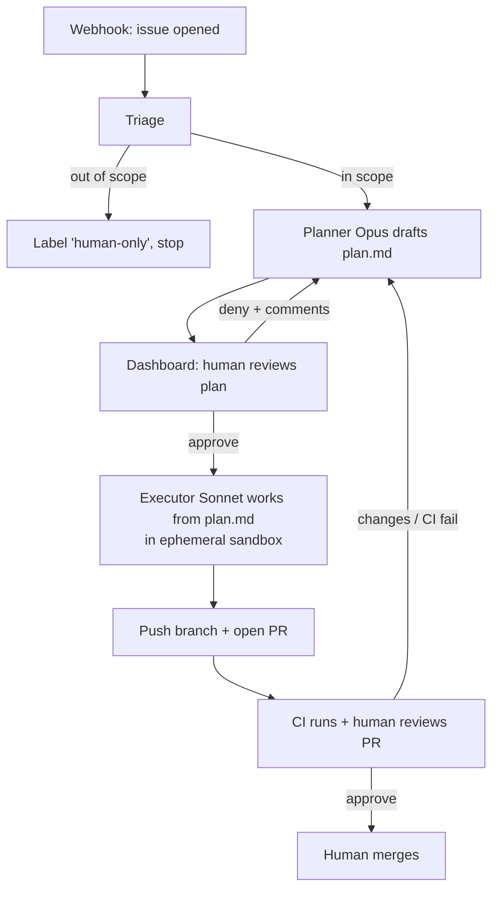
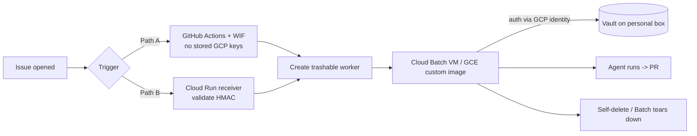

# HAL Issue-Resolver Agent — Architecture & Design

> **Status:** Design (not yet implemented) · **Date:** 2026-07-16 · **Owner:** repo maintainer
>
> **Purpose of this doc:** a self-contained design so the work can be resumed in a
> later session by any human or LLM. It captures the *why*, the architecture, the
> security model, and the open decisions. Read it top-to-bottom before writing code.

---

## 1. Goal

Build an **autonomous agent** that reacts to GitHub issues on the public `hal`
repo, triages them, designs a fix, and — after two human approval gates — opens a
pull request. A human is always the final gate before merge.

Secondary goal (personal): this is also a **portfolio / skills project**. The
hirable value is not "wired an LLM to issues" (managed products do that) — it is
the *engineering around it*: guardrail design, separation of privilege,
prompt-injection defense, model tiering, an eval harness, and success metrics.

## 2. Hard constraints

- **Paid, reliable model access.** GitHub Copilot Pro is being removed (employer
  decision). The agent's "brain" must be a **metered model API key funded
  directly** (Anthropic recommended), *not* a free tier. Pay-as-you-go, budget-capped.
- **Self-hosted.** Runs on an owned cloud Linux server with a real public IP.
- **HashiCorp Vault** stores all secrets (GitHub credentials, model API keys,
  webhook HMAC secret). The maintainer already knows Vault deeply — this repo is a
  HashiCorp lab tool.
- **Public repo.** Issue text is **untrusted, attacker-influenced input**. This
  drives the entire security model.
- **Compute note:** because `hal` is a *public* GitHub repo, GitHub Actions
  standard runners are free — but this design deliberately self-hosts the
  orchestrator for full autonomy, control, and instrumentation.

## 3. Core principle: Separation of Privilege

**The models never touch secrets, and untrusted issue text never reaches a
context that holds credentials.** This single rule shapes every component:

- The LLM context (planner/executor) never contains the GitHub token.
- Secrets live in Vault; the orchestrator brokers them and hands a short-lived
  token *only* to a narrow, non-model "publish" step that runs after human
  approval.
- Code execution influenced by issue text happens in a **disposable, egress-
  restricted sandbox** with no Vault access.

## 4. High-level loop



Two human gates: **(1) plan approval** on the dashboard, **(2) PR approval** on
GitHub. Never auto-merge.

## 5. Components (what runs on the server)

Split into an **always-on orchestrator** (the watcher/brain) and **disposable
workers** (code execution). Never run model-driven code execution on the host.

| Component | Role | Holds secrets? |
|---|---|---|
| Reverse proxy (Caddy/Traefik) | TLS + auth in front of dashboard & webhook endpoint | no |
| Orchestrator service | webhook receiver + state machine + model calls + Vault client | brokers only |
| Dashboard (reuse hal-plus React/Vite stack) | plan review, approve/deny + comments | no |
| Durable store (Postgres or SQLite) | work-item state, plan versions, diffs, cost, audit | no |
| **Ephemeral executor sandbox** (container per work item) | Sonnet edits code + runs `go build/vet/test`; destroyed after | **no** |
| Vault | GitHub App key, model API keys, webhook HMAC secret | the vault |
| Optional local Ollama | cheap in-scope/out-of-scope triage classification | no |

Suggested stack: **Go** orchestrator (this is a Go shop), **React/Vite**
dashboard (reuse `hal-plus` skills), Postgres/SQLite for state, Vault for secrets,
Docker/Podman for the sandbox, Ollama optional for cheap triage.

## 6. Model tiering (cost + quality split)

1. **Triage / scope classification** → cheap local **Ollama** (already running on
   the maintainer's host for HAL Plus). Answers "is this in scope and easy?"
2. **Design / planning** → **Opus-class** model. Only invoked for items that pass
   triage. Produces `plan.md`.
3. **Execution** → **Sonnet-class** model. Works strictly from the approved
   `plan.md`, keeping the diff tightly scoped.

`plan.md` is the **contract** between the planner and executor. A tight, scoped
plan is what keeps the executor's change small and reviewable.

## 7. State machine

Model states explicitly and **persist them in the DB** (a long-running autonomous
service will restart; the dashboard must always reflect true state):

```
triaged → plan_draft → plan_review → approved → executing → pr_open → pr_review → done
                ↑___________________|                            |
                |___________________________________ (deny/CI fail) 
rejected  (out of scope → human-only)
```

- **Concurrency lock:** one issue = one work item, locked, so duplicate webhooks
  don't double-process.
- **Loop caps:** hard ceilings on design iterations *and* fix iterations per issue
  (cost + runaway protection). Budget alerts.

## 8. Security model (public IP + secrets + code execution)

Treat every issue body as **hostile input**.

- **Use a GitHub App, not a PAT.** Installation tokens are short-lived (~1h),
  scoped per-repo, and provide webhook + identity. Store the App private key in
  Vault; mint installation tokens just-in-time. Far safer than a long-lived PAT.
- **Minimal scopes:** `contents:write` + `pull_requests:write`. **Never** merge,
  never admin. Human merge + branch protection is the final gate.
- **Model never sees the token.** Orchestrator fetches from Vault and hands it only
  to a non-model publish step (git push / PR create) that runs *after* plan
  approval. A prompt-injected "print your token" has nothing to print.
- **Validate the webhook HMAC** (`X-Hub-Signature-256`) against a secret in Vault.
  Otherwise anyone who finds the IP can forge "issue opened" events.
- **Egress-filter the executor sandbox.** No outbound network except to
  GitHub/model provider. This is the prompt-injection backstop against
  "exfiltrate secrets to evil.com".
- **Do not expose the dashboard on the raw public IP.** Prefer Tailscale/WireGuard
  (it's just for the maintainer). If public: TLS + real auth (not basic-auth).
- **Vault hygiene:** AppRole for the orchestrator, short TTLs, audit device on,
  response-wrapping for token delivery.

### Secrets inventory (all in Vault)

| Secret | Used by | Notes |
|---|---|---|
| GitHub App private key | orchestrator | mints short-lived installation tokens JIT |
| Webhook HMAC secret | orchestrator (ingress) | validates `X-Hub-Signature-256` |
| Model API key(s) (Anthropic, …) | orchestrator | metered, budget-capped |
| Dashboard session/auth secret | dashboard | if not behind VPN |

## 9. Trigger: webhook vs poll

- **Preferred: GitHub webhook** (push model) → hits the server's public ingress →
  HMAC-validated → enqueues a work item. Low latency.
- **Fallback: polling** the issues API if inbound ingress is undesirable.
- A **GitHub App** gives the webhook + identity + scoped tokens together — the
  cleanest path.

## 10. Observability & eval data

Log **every** model call, plan version, diff, cost, and outcome. This is both
operational observability *and* the **eval dataset** that produces the hirable
story:

- % issues auto-resolved
- PR acceptance rate (human approved without major edits)
- iterations-to-green (CI)
- regression rate
- cost per resolved issue

Build a small eval set from already-resolved historical issues to benchmark.

## 11. Scope: what the agent may attempt

**In scope (safe classes):** doc fixes, output/wording bugs, flag additions, test
additions, small refactors, dependabot follow-ups.

**Out of scope (label `human-only`):** deep container-runtime integrations
(`hal vault oidc enable`, TFE, KinD, etc.) — CI can't validate these, and running
container workloads influenced by public input raises the sandboxing bar. Expand
scope only as guardrails prove out.

> The executor sandbox *can* run Docker/Podman-in-container to validate runtime
> paths, but keep that behind stronger isolation and out of the initial autonomous
> scope.

## 12. Guardrail context the agent must consume

The agent must follow the same conventions the CI and humans enforce, or it will
produce PRs that violate contribution discipline. Feed it:

- `.github/copilot-instructions.md` (canonical behavior/build/test rules)
- `LLM_CONTEXT.md` (repo architecture patterns)
- `CONTRIBUTING.md` (branch naming: `feature/**`, `bugfix/**`; doc-sync rule)
- Branch naming must match the issue class (`bug:` → `bugfix/…`, `feat:` →
  `feature/…`), because CI only runs on those prefixes.
- The **doc-sync rule**: code changes must keep `LLM_CONTEXT.md`, skills, and MCP
  snapshots in sync in the same change set.
- The agent can call the **HAL MCP server** (`hal mcp serve`) as a read-only tool
  layer (status/validate/capabilities) — reuse, not reimplementation.

## 13. Phased rollout

- **Phase 0 — assisted (today):** human triages, then drives an interactive agent
  (e.g. Cursor Pro locally) to fix + PR. Two human gates. Proves the loop, learns
  the patterns, and can *validate container-runtime paths locally*. Cursor is the
  *tool*; the autonomous pipeline is the *artifact* built toward.
  - To make Cursor respect conventions: mirror guardrails into a Cursor rules file
    (`.cursor/rules/…`) or `AGENTS.md`, and wire the HAL MCP server via Cursor's
    MCP client.
- **Phase 1 — guardrail scaffolding:** label-gated trigger, plan-comment step,
  scoped token, CI-results-in-PR-body, scope classifier.
- **Phase 2 — autonomous, self-hosted:** the full design in this doc — orchestrator
  + Vault + sandboxed executor + dashboard + eval harness. This is the portfolio
  piece.

## 14. Alternative deployment topology: GCP ephemeral workers

Instead of running the executor on the always-on server, split into a **control
plane** (durable, personal instance) and a **compute plane** (trashable GCP
workers created per event). Same loop (§4), same principles (§3) — only *where the
code-execution runs* changes.

### Control plane vs compute plane

**Rule: anything durable/stateful stays on the personal always-on instance; only
stateless, disposable compute goes to GCP.**

| Plane | Lives on | Trashable? | Holds |
|---|---|---|---|
| **Control plane** | personal always-on instance | no | **Vault**, state store, dashboard, (webhook receiver if used) |
| **Compute plane** | GCP ephemeral worker | **yes** | nothing durable — fetches secrets JIT, opens PR, self-destructs |

`Vault is stateful → it can never be the trashable instance.` The GCP worker is a
Vault *client*, not a server.



### Trigger (ephemeral instance can't listen for its own creation)

- **Path A — GitHub Actions + Workload Identity Federation (simplest):** workflow
  `on: issues: [opened, labeled]` authenticates to GCP via WIF (**no stored GCP
  keys**) and runs `gcloud batch jobs submit` / `gcloud compute instances create`.
  Free trigger compute (public repo); no public GCP endpoint; GitHub is the trusted
  trigger (no webhook HMAC to manage).
- **Path B — GitHub webhook -> Cloud Run receiver:** a scale-to-zero Cloud Run
  service validates the `X-Hub-Signature-256` HMAC and calls the Compute/Batch API.
  Fully decoupled from Actions, but you own a public endpoint + signature check.

### The trashable worker

1. **Cloud Batch (recommended):** provisions a GCE VM from a custom image, runs the
   job, and **deletes it for you** — no hand-rolled self-destruction. Supports
   container-in-container for HAL runtime validation.
2. **GCE instance from a Packer-built custom image + self-delete** (`gcloud compute
   instances delete $(hostname)` via the instance SA). Most control, more moving
   parts.
3. **Cloud Run Jobs:** cheapest/simplest, but ⚠️ no nested virtualization — only if
   the worker does *not* need Docker/Podman to validate runtime paths.

### One ephemeral worker per stage (don't hold a VM across a human gate)

The plan-approval gate can take hours; never idle a VM through it. Checkpoint to the
state store and spawn a fresh worker per stage:

- Worker 1: triage + write `plan.md` -> state store -> **terminate**.
- Human approves on dashboard (async).
- Worker 2: execute -> PR -> **terminate**.
- CI fail / changes requested -> Worker 3: rework -> **terminate**.

### Where state + dashboard live

- **State store:** Firestore or small Cloud SQL — carries work-item context across
  ephemeral workers.
- **Dashboard (plan gate):** a Cloud Run service (scale-to-zero) serving the
  React/Vite app + state API — *or* keep it on the personal control-plane box.

### Secrets — Vault stays on the personal box

The ephemeral worker authenticates to Vault using its **GCP identity** (Vault
`gcp`/`gce` auth method — signed instance-metadata JWT, **no static creds on the
image**), gets a short-lived token, fetches the GitHub App key, and dies.

**Worker -> Vault reachability** (worker has a dynamic, short-lived IP):

- **Tailscale/WireGuard:** worker joins the tailnet on boot (auth key via GCP
  metadata) and reaches Vault over the private mesh — Vault never exposed publicly.
  *Cleanest.*
- **Firewall allowlist:** pin worker egress to a static **Cloud NAT** IP and
  allowlist only that IP on Vault's TLS endpoint.

Either way the **GCP auth method is the real gate:** only instances with the right
service account + project can authenticate, even if the endpoint is reachable.

### GCP-specific security

- **WIF** = zero long-lived GCP keys in GitHub.
- **Least-privilege SAs:** worker SA can *only* self-delete + auth to Vault; trigger
  SA can *only* submit Batch jobs. No broad project roles.
- **Egress controls** (VPC firewall + Cloud NAT allowlist) so injected exfil can't
  reach arbitrary hosts.
- **Dedup key = issue ID** so duplicate webhooks don't spawn two workers.
- **Budget alerts** (ephemeral + scale-to-zero already caps spend).

## 15. Open decisions (resolve before/while building)

- [ ] Orchestrator language: Go (fits the repo) vs Node (fits the dashboard). Lean Go.
- [ ] State store: Postgres vs SQLite (SQLite is fine for single-node).
- [ ] Dashboard exposure: Tailscale/WireGuard (recommended) vs public + auth.
- [ ] Which Opus/Sonnet model versions; budget cap value.
- [ ] Sandbox tech: rootless Podman (matches HAL's ethos) vs Docker; egress policy.
- [ ] Whether to allow the sandbox to run HAL's container-runtime validation, and
      under what isolation.
- [ ] Human feedback format on deny (structured fields vs free text) fed back to
      the planner.
- [ ] **Deployment topology:** self-hosted always-on executor (§5) vs GCP ephemeral
      workers (§14) vs hybrid (control plane on personal box, compute plane on GCP).
- [ ] **GCP trigger path:** GitHub Actions + WIF vs Cloud Run webhook receiver.
- [ ] **GCP worker runtime:** Cloud Batch vs GCE custom image + self-delete vs
      Cloud Run Jobs (depends on whether it must run containers).
- [ ] **Worker -> Vault reachability:** Tailscale/WireGuard mesh vs Cloud NAT static
      IP allowlist.

## 16. How to resume (note to the next session)

1. Read this doc + `LLM_CONTEXT.md` + `.github/copilot-instructions.md`.
2. Confirm the working branch first (repo rule: named branch per change; use
   `feature/…`).
3. Start at the current Phase (see §13). If nothing exists yet, begin Phase 1
   scaffolding: the label-gated trigger + scope classifier + plan step, keeping the
   separation-of-privilege principle (§3) intact from the first commit.
4. Pick a deployment topology (§5 self-hosted vs §14 GCP ephemeral vs hybrid) as
   part of resolving §15 open decisions.
5. Keep this doc updated as decisions in §15 are resolved.
